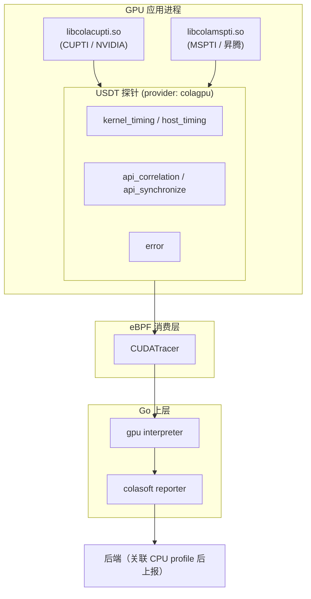
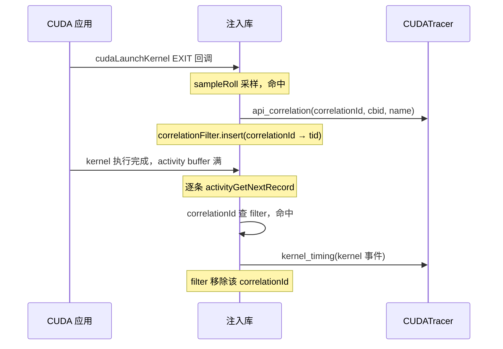

# parcagpu 开发指南

## 1. 概述

parcagpu 是一个 GPU 活动采集库，通过进程内注入接入厂商的 profiling 接口（NVIDIA 用 CUPTI，昇腾用 MSPTI），把 GPU 内核执行、host API、显存拷贝等事件以 USDT 探针的形式暴露出来，供 eBPF 侧消费，最终与 CPU profile 关联后上报。

parcagpu 以 vendoring 方式集成进 opentelemetry-ebpf-profiler，编译产物为两个注入库：`libcolacupti.so`（NVIDIA）和 `libcolamspti.so`（昇腾）。注入库发出的 USDT 探针由上层 `CUDATracer`（eBPF）读取，经 gpu interpreter 解析后，交给 colasoft 模块的 reporter 与 CPU profile 关联上报。

## 2. 总体架构

数据从「GPU 应用进程内」到「上层上报后端」共分四层：



- **采集层**：两个注入库在进程内订阅厂商回调，把原始事件规整为 vendor-neutral 的 `ActivityEvent`，再批量打到 USDT 探针。
- **传输层**：USDT 探针是进程内的静态埋点，eBPF 程序 attach 上去，通过 ring buffer 把事件搬到内核态再交给用户态。
- **消费层**：`CUDATracer` 读取 USDT 探针事件，`gpu interpreter` 负责 correlationId 关联、kernel 名 demangle 等解析。
- **后端层**：colasoft reporter 把 GPU 事件与 CPU profile 做关联后上报。

## 3. 核心组件与目录结构

```
parcagpu/
├── src/                 # 注入库采集实现
├── ebpf/                # BPF 侧共享结构定义
├── proton/              # 第三方 CUPTI 封装（git submodule）
├── ascend/              # 昇腾 MSPTI 头文件
├── CMakeLists.txt       # CMake 构建
└── Makefile             # 构建 / 测试编排
```

### src/ — 采集核心

| 文件 | 职责 |
|---|---|
| `cupti.cpp` | NVIDIA 后端：订阅 CUPTI 回调，消费 activity 记录，批量发探针 |
| `mspti.cpp` | 昇腾后端：订阅 MSPTI 回调，通过 `aclInit` 拦截做懒加载 |
| `probes.d` | USDT 探针定义（provider `colagpu`） |
| `correlation_filter.cpp/.h` | correlationId 关联：kernel / memcpy / graph 的匹配 |
| `env_config.cpp/.h` | `COLAGPU_*` 环境变量校验 |
| `activity.h` | vendor-neutral 的 `ActivityEvent` 结构 |
| `sampling.h` | 采样降载（`sampleRoll`、阈值轮询线程） |
| `error.h` | 错误探针辅助 |

### 其他目录

- `ebpf/cupti_bpf.h`：与上层 `cuda.ebpf.c` 共享的 BPF 结构布局（kernel activity 等）。
- `proton/`：Triton 项目的 git submodule，parcagpu 只链接其中少量源文件（`CuptiApi.cpp`、`CudaApi.cpp`、`CuptiCallbacks.cpp`），用于 CUPTI 回调 / activity 的封装。
- `ascend/`：昇腾 MSPTI 的接口头文件（`mspti.h` 等）。

## 4. 数据流与探针

### 4.1 USDT 探针一览

注入库在 `src/probes.d` 中定义（provider `colagpu`）。共 10 个探针，但产品当前只消费前 5 个：

| 探针 | 参数 | 描述 | 产品消费 |
|---|---|---|---|
| `api_correlation` | correlationId, signedCbid, name | API 回调关联 | ✅ |
| `api_synchronize` | start, end, syncKind | 同步调用耗时 | ✅ |
| `host_timing` | ptrs, count | host API 计时 | ✅ |
| `kernel_timing` | ptrs, count | kernel / memcpy 计时 | ✅ |
| `error` | code, message, component | 采集错误 | ✅ |
| `pc_sample_batch` | records, count | PC 采样记录 | ❌ |
| `stall_reason_map` | names, count | stall reason 名表 | ❌ |
| `cubin_loaded` | cubinCrc, cubin, cubinSize | cubin 模块加载 | ❌ |
| `cubin_unloaded` | cubinCrc | cubin 模块卸载 | ❌ |
| `gpu_config` | deviceId, samplingFactor, clockKHz, smCount | GPU 配置 | ❌ |

### 4.2 correlationId 关联机制

GPU 采集的核心难点：host 侧的 API 调用（launch）与 device 侧的 kernel 执行是异步的，两者靠 CUPTI / MSPTI 分配的 `correlationId` 关联。

**采样降载**：对每次 launch 以概率 `sampleRoll()` 决定是否跟踪，概率来自 `/tmp/parcagpu.threshold` 里的 per-mille 阈值（Go 侧通过 `/proc/<pid>/root/tmp` 写入，注入库后台线程每 5s 轮询）。未命中的 launch 不发 `api_correlation` 探针、也不插入关联表，其 kernel activity 天然匹配不上、直接丢弃。CUDA graph launch 例外，恒采样。

**三类关联表**：

- `CorrelationFilter`（普通 kernel）：launch EXIT 时 `insert(correlationId → tid)`，kernel activity 到达时 `check_and_remove` 命中即发 `kernel_timing`。
- `GraphCorrelationMap`（CUDA graph）：graph 复用同一个 correlationId，靠 2-slot 状态机配合 buffer cycle 判断 graph 的 kernel 是否都已到达、以决定何时清理条目。
- `MemcpyCorrelationMap`（memcpy）：runtime 回调捕获 pid/tid，activity 记录用 correlationId 反查。

### 4.3 数据流时序

一次 kernel launch 的完整数据流：



昇腾（MSPTI）后端链路与此类似：MSPTI 的 LAUNCH 类 runtime 回调 → `api_correlation` → kernel activity → `kernel_timing`，区别是订阅 MSPTI 回调（并通过 `aclInit` 拦截懒加载），而非 CUPTI。

之所以 CUPTI 能立即初始化、MSPTI 必须懒加载，源于两者注入机制不同：

- **CUPTI**：经 `CUDA_INJECTION64_PATH` 注入，由 CUDA driver 在自身就绪后回调注入库的 `InitializeInjection()`。此时 CUDA runtime/driver 已加载，`libcupti` 可被 dlopen 并立即订阅。
- **MSPTI**：经 `LD_PRELOAD` 加载 `libcolamspti.so`（它不链接 `libmspti.so`，靠 dlsym 解析符号）。LD_PRELOAD 对象按逆序初始化，`libcolamspti.so` 的 constructor 先于 `libmspti.so` 的 constructor 执行，而后者才负责 dlopen `libprofapi.so`——过早 `msptiSubscribe` 会因 `libprofapi.so` 尚未加载而失败；且 MSPTI 回调需等 NPU 设备真正初始化后才安全生效。`aclInit` 是 CANN runtime 中唯一不被 `libmspti.so` 拦截的入口，是可靠的「runtime 就绪」信号，因此在真实的 `aclInit` 成功后再懒加载订阅。

## 5. 构建与部署

### 5.1 构建

```bash
make local          # 本地 CMake 构建（RelWithDebInfo）
make debug          # 本地 debug 构建
make build-amd64    # Docker 交叉编译 amd64 的 .so
make build-arm64    # Docker 交叉编译 arm64 的 .so
make build-all      # 两个架构
make clean          # 清理
```

产物输出到 `build/<arch>/`（Docker）或 `build-local/lib/`（本地）。

### 5.2 注入方式

- **NVIDIA（CUDA）**：设置环境变量后启动应用，CUDA driver 会加载注入库并回调其 `InitializeInjection()`：

  ```bash
  export CUDA_INJECTION64_PATH=/path/to/libcolacupti.so
  ./my_cuda_app
  ```

- **昇腾（Ascend）**：通过 `LD_PRELOAD` 同时加载 `libmspti.so`（昇腾提供）与 `libcolamspti.so`（本库编译）：

  ```bash
  LD_PRELOAD=/path/to/libmspti.so:/path/to/libcolamspti.so ./my_ascend_app
  ```

### 5.3 环境变量与采样配置

注入库目前唯一生效的环境变量是 `COLAGPU_DEBUG`（默认 off），设为非空即打开调试日志。

采样阈值不通过环境变量下发，而是写文件：Go 侧把 per-mille 阈值（0–1000）写入目标进程的 `/tmp/parcagpu.threshold`（经 `/proc/<pid>/root/tmp`），注入库后台线程每 5s 轮询读取，`sampleRoll()` 据此做概率采样。1000 全采样，0 不采样。

## 6. 功能验证方式

用 `parcagpu.bt`（bpftrace 脚本）验证注入库的探针接口是否正常输出。

### 6.1 用法

```bash
sudo bpftrace parcagpu.bt /path/to/libcolacupti.so   # NVIDIA
sudo bpftrace parcagpu.bt /path/to/libcolamspti.so   # 昇腾
```

脚本参数 `$1` 是注入库路径，bpftrace 据此 attach 到库内嵌的 USDT 探针。

### 6.2 验证步骤

1. 一个终端先启动 bpftrace，attach 到注入库；
2. 另一个终端按 5.2 的方式启动 GPU 应用；
3. 观察 bpftrace 输出。

### 6.3 输出解读

脚本按探针输出 5 类事件：

- `[CORR]`：`api_correlation`——每次被采样的 launch，打印 correlationId / cbid / API 名；
- `[SYNC]`：`api_synchronize`——同步调用耗时；
- `[KERNEL_TIMING]`：`kernel_timing`——kernel（含 name）与 memcpy（含方向 / 字节数）的计时；
- `[HOST_TIMING]`：`host_timing`——host 侧 launch API 计时；
- `[ERROR]`：`error`——API 返回非零码时的错误。

正常情况下，跑一个会发 kernel 的应用，应能看到 `[CORR]` → `[KERNEL_TIMING]` 成对出现、correlationId 一一对应。若只有 `[CORR]` 而没有对应的 `[KERNEL_TIMING]`，说明关联或 activity 消费出了问题。

## 7. 使用限制

- **kernel launch 概率采样**：以 launch 为粒度按 per-mille 阈值概率采样，未命中的 launch 不发 `api_correlation`、也不插入关联表，其 kernel activity 自然匹配不上而被丢弃。因此采集到的是 launch 的采样子集，而非全量；CUDA graph launch 例外，恒采样。
- **采样阈值非实时下发**：阈值经 `/tmp/parcagpu.threshold` 文件下发（Go 侧经 `/proc/<pid>/root/tmp` 写入），注入库后台线程每 5s 轮询生效，最坏有 ~5s 的生效延迟；且需要上层以 hostPID / root 权限写入该文件。
- **只能进程启动时注入**：`CUDA_INJECTION64_PATH`（NVIDIA）与 `LD_PRELOAD`（昇腾）均为进程启动时生效的机制，无法对已运行的进程动态注入采集。
- **对 GPU / NPU 的版本要求**：
  - NVIDIA：`libcolacupti.so` 运行时经 proton 动态 dlopen CUPTI（不链接 `libcupti.so`），对 CUDA / CUPTI 版本无硬性编译约束，同一份 `.so` 适配任意 CUDA 版本；注入依赖 `CUDA_INJECTION64_PATH`（PTX 注入），要求 CUDA 11 及以上；库内的 PC 采样能力要求 GPU compute capability ≥ 7.5（Turing 及以上），但产品当前不消费 PC 采样，此条仅代表库的硬件能力边界。构建侧需 CUDA 12.x 头文件。
  - 昇腾：依赖 CANN 提供的 `libmspti.so` / `libprofapi.so`（MSPTI 接口）；demo / 构建默认 CANN 9.1.0（可通过 `ASCEND_HOME_PATH` / `CANN` 覆盖，如 8.5.2）。公开渠道无法查到 MSPTI 对 CANN 版本、NPU 型号的明确要求。
